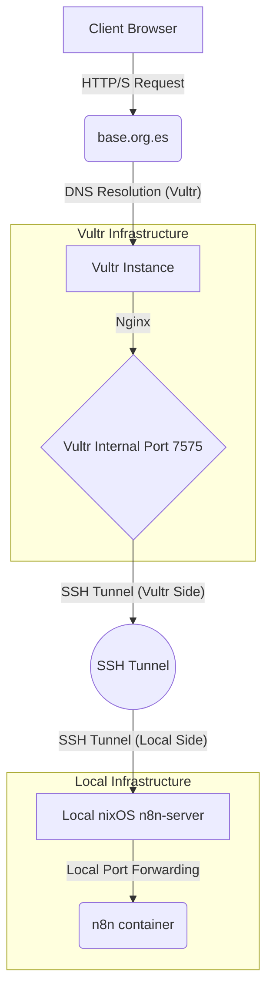

# Serve n8n with nixOS

I have seen nix and nixOS all over the internet and see how people swear by it and the rock solid deployments it can offer. 

When I wanted to look deeper into n8n I took the opportunity to do both things at the same time, learn n8n and nix.

# n8n

n8n is a "Fair-code workflow automation platform with native AI capabilities". [n8n-io/n8n](https://github.com/n8n-io/n8n) 
My tldr; better interface for zapier that my father can finally use and 🪄 AI 🪄

n8n can be run with docker and more recently with npx directly. 
Regretfully, I did not get the memo in time and started this project with docker instead before npx was a viable option. 

nixOS is attractive due to the whole system being declarable on the configuration. And if there is things you want to leave non declarative, you can do so no problem!

Because the system is meant to be declarative and dependencies are separately stored. You can even use different versions of packages on the same system without interfering. Due to this new found capability with nixOS, the nix way to run services is not with a virtualization layer but directly on bare metal.

TBD will transfer from docker to running directly with npx. 

To have run the container, it pretty much worked right away. n8n needs SSL certificates to work properly, other than that I used the docker compose on the docs changing a couple details and importing the DB secrets from an .env file
# nixOS

[nixOS](https://nixos.wiki/) is a Linux distribution based on the nix package manager that uses an immutable design and an atomic update model. 
Its use of a declarative configuration system allows reproducibility, portability and a light server.

After grabbing the GUI installer to start familiarizing with the new distro I set up ssh keys and sshd service in the n8n-server machine to start treating it like a real server.

This is what I did to ensure ssh would be available every time the system boots and the right public keys are authorized.
Furthermore and to be better safe than sorry, fail2ban with some whitelisted local IPs.
```` nix
  # SSH configs
  programs.ssh.startAgent = true;

  # Add github and public facing server keys every time

  users.users.server.openssh.authorizedKeys.keys = [
    "/home/server/.ssh/github.pub"
    "/home/server/.ssh/vultr.pub"
  ];

  # Enable the OpenSSH daemon.
  services.openssh = {
    enable = true;
    settings = {
      PasswordAuthentication = false; # only key pairs 🔑
      PrintMotd = true;
    };
  };

  services.fail2ban = {
    enable = true;
    maxretry = 3;
    bantime-increment.enable = true;
    ignoreIP = [
      "127.0.0.1/8" # local machine traffic
      "10.0.0.174" # local network traffic
      "100.67.201.23" # local tailscale traffic
    ];
  };
````

In order to have access to n8n-server even when not at home and in line with the rest of my homelab, tailscale
```` nix
  # Enable Tailscale
  services.tailscale.enable = true;

  # Networking
  # Enable SSH access in from Tailscale network 22
  # Enable http/s traffic to go through 80 and 443 for access n8n thorugh tailscale
  networking.firewall = {
    enable = true;
    trustedInterfaces = ["tailscale0"];
    allowedUDPPorts = [config.services.tailscale.port];
    allowedTCPPorts = [22 443 80];
  };

`````

One of the first big issues I faced was loosing my old configuration after I made breaking changes while trying to properly set up docker.
nixOS will *always* have a working build, that is true and extremely useful. If you run nixOS, you will never have a broken system, period.
BUT if you loose your old `configuration.nix` because of a change not tracked properly, you have lost it.

To fix this, you can set up nixOS to copy your config files to the appropriate system generation directory.
````nix
  # Copy the NixOS configuration file and link it from the resulting system
  # (/run/current-system/configuration.nix). This is useful in case you accidentally delete configuration.nix.
  system.copySystemConfiguration = true;
`````
This setting works even in more complex multi-file configuration system like in my regular dotfiles.

# Serve
The easiest and safest way I found to serve a locally hosted service through a public domain that can get Let's Encrypt SSL certificates is with an ssh tunnel.
I started using Serveo with worked great BUT it would disconnect at once a day even when using autossh. For that I had to move into hosting my own public facing server.
I chose to use Vultr with the cheapest possible VPS. It runs nginx in an AlmaLinux system.

This is the flow for a given user:

This way I don't need to open any ports in my local network and open my homelab this way. With this ssh tunnel, traffic should only be able to access what is served on the local port is pointed to and nothing else. 

This means that I am unable to ssh into my n8n-server through base.org.es at all even though sshd is running, even from one of the whitelisted IPs.
