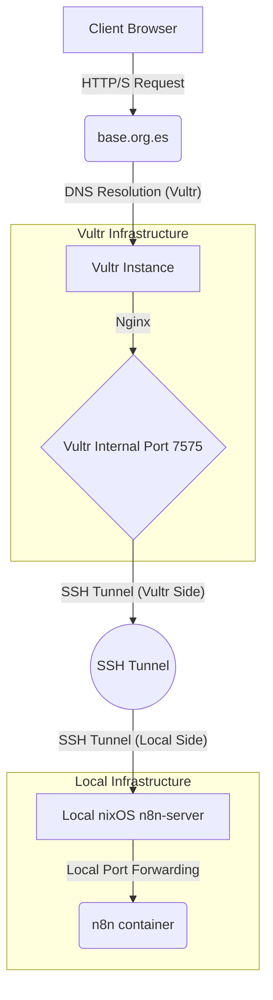

# Serve n8n with nixOS

*This project combined two goals: learning n8n for workflow automation and exploring nixOS for infrastructure management. The challenge was exposing n8n to external users without compromising my homelab's security model.*

*I needed an automation platform intuitive enough for non-technical users, something my father (who runs a small business) could actually use without IT support, while keeping my home network completely isolated from the public internet.*

# n8n

n8n is a "Fair-code workflow automation platform with native AI capabilities". [n8n-io/n8n](https://github.com/n8n-io/n8n)

I needed an automation platform intuitive enough for non-technical users, something my father (who runs a small business) could actually use without IT support. Unlike my other homelab services that only I access via Tailscale, n8n needed to be available to external users who shouldn't have VPN access to my entire network.

n8n can be run with docker and more recently with npx directly. However, Docker emerged as the better choice for this specific use case, despite nixOS's preference for native declarative services.

### Why Docker Over Native nixOS

While nixOS excels at declarative system management, Docker provides specific advantages for integration tools like n8n:

**Dependency Completeness:** n8n is an "integrator" tool that often calls external binaries (pandoc, ffmpeg, etc.). The official Docker image bundles all required system tools. Running natively on NixOS would require manually ensuring every possible dependency is available in the system path.

**Release Speed:** Docker images receive updates faster than Nixpkgs. For a service handling external integrations, having the latest features and security patches matters.

**Security Isolation:** Container boundaries provide crucial protection. If n8n has a vulnerability or memory leak, it stays contained within the cgroup/namespace, keeping the host nixOS system clean.

**Operational Reality:** I'm running a single instance. The overhead of maintaining a custom nix module for n8n only makes sense at scale (multiple tenants). For this use case, Docker's tradeoffs favor pragmatism over purity. 

To have run the container, it pretty much worked right away. n8n needs SSL certificates to work properly, other than that I used the docker compose on the docs changing a couple details and importing the DB secrets from an .env file
# nixOS

[nixOS](https://nixos.wiki/) is a Linux distribution based on the nix package manager that uses an immutable design and an atomic update model. 
Its use of a declarative configuration system allows reproducibility, portability and a light server.

After grabbing the GUI installer to start familiarizing with the new distro I set up ssh keys and sshd service in the n8n-server machine to start treating it like a real server.

This is what I did to ensure ssh would be available every time the system boots and the right public keys are authorized.
Furthermore and to be better safe than sorry, fail2ban with some whitelisted local IPs.
```` nix
  # SSH configs
  programs.ssh.startAgent = true;

  # Add github and public facing server keys every time

  users.users.server.openssh.authorizedKeys.keys = [
    "/home/server/.ssh/github.pub"
    "/home/server/.ssh/vultr.pub"
  ];

  # Enable the OpenSSH daemon.
  services.openssh = {
    enable = true;
    settings = {
      PasswordAuthentication = false; # only key pairs 🔑
      PrintMotd = true;
    };
  };

  services.fail2ban = {
    enable = true;
    maxretry = 3;
    bantime-increment.enable = true;
    ignoreIP = [
      "127.0.0.1/8" # local machine traffic
      "10.0.0.174" # local network traffic
      "100.67.201.23" # local tailscale traffic
    ];
  };
````

In order to have access to n8n-server even when not at home and in line with the rest of my homelab, tailscale
```` nix
  # Enable Tailscale
  services.tailscale.enable = true;

  # Networking
  # Enable SSH access in from Tailscale network 22
  # Enable http/s traffic to go through 80 and 443 for access n8n thorugh tailscale
  networking.firewall = {
    enable = true;
    trustedInterfaces = ["tailscale0"];
    allowedUDPPorts = [config.services.tailscale.port];
    allowedTCPPorts = [22 443 80];
  };

`````

One of the first big issues I faced was losing my old configuration after I made breaking changes while trying to properly set up docker.
nixOS will *always* have a working build, that is true and extremely useful. If you run nixOS, you will never have a broken system, period.
BUT if you loose your old `configuration.nix` because of a change not tracked properly, you have lost it.

To fix this, you can set up nixOS to copy your config files to the appropriate system generation directory.
````nix
  # Copy the NixOS configuration file and link it from the resulting system
  # (/run/current-system/configuration.nix). This is useful in case you accidentally delete configuration.nix.
  system.copySystemConfiguration = true;
`````
This setting works even in more complex multi-file configuration system like in my regular dotfiles.

# Serve
The easiest and safest way I found to serve a locally hosted service through a public domain that can get Let's Encrypt SSL certificates is with an ssh tunnel.
I started using Serveo with worked great BUT it would disconnect at once a day even when using autossh. For that I had to move into hosting my own public facing server.
I chose to use Vultr with the cheapest possible VPS. It runs nginx in an AlmaLinux system.

This is the flow for a given user:

This way I don't need to open any ports in my local network and open my homelab this way. With this ssh tunnel, traffic should only be able to access what is served on the local port is pointed to and nothing else. 

This means that I am unable to ssh into my n8n-server through base.org.es at all even though sshd is running, even from one of the whitelisted IPs.

---

## February 2026: Security Validation

### CVE-2026-21858 (Ni8mare)

In January 2026, n8n disclosed [CVE-2026-21858](https://github.com/n8n-io/n8n/security/advisories/GHSA-v4pr-fm98-w9pg), a critical vulnerability that could have allowed remote code execution. This incident validated the Docker-over-native architecture decision.

**Container Isolation in Action:**
Even if an attacker had exploited this vulnerability, the Docker container boundaries would have contained the breach. The attacker's access would have been limited to the container environment, not the underlying nixOS host system. This is exactly the kind of defense-in-depth that justifies Docker for integration-heavy services.

The container was patched within hours of the security advisory, well before public disclosure, demonstrating the operational benefits of running containerized services with automated update workflows.

### Uptime & Reliability

After installing a UPS in my homelab, the system has achieved **99.99% uptime** over the past 3 months. The combination of nixOS's atomic updates and Docker's container management has created a remarkably stable platform.

*[Uptime monitoring screenshot placeholder]*

---

## Lessons Learned

**Declarative vs. Pragmatic Infrastructure**
nixOS's declarative philosophy is powerful, but pragmatism matters. For services like n8n that integrate with dozens of external tools, Docker's dependency management and security isolation outweigh the purity of native nixOS modules.

**Threat Modeling**
The reverse SSH tunnel architecture proved correct: external users access n8n through a controlled path with no direct network access to my homelab. n8n's built-in authentication handles user management, while the SSH tunnel provides transport security without exposing internal services.

**Cloud Independence**
This architecture intentionally avoids Cloudflare or other managed infrastructure dependencies. The VPS ($5/month), SSH tunnel, and Let's Encrypt provide complete control over the stack.

**GitHub Repository:** [github.com/Aureliusf/nixOS-n8n](https://github.com/Aureliusf/nixOS-n8n)
