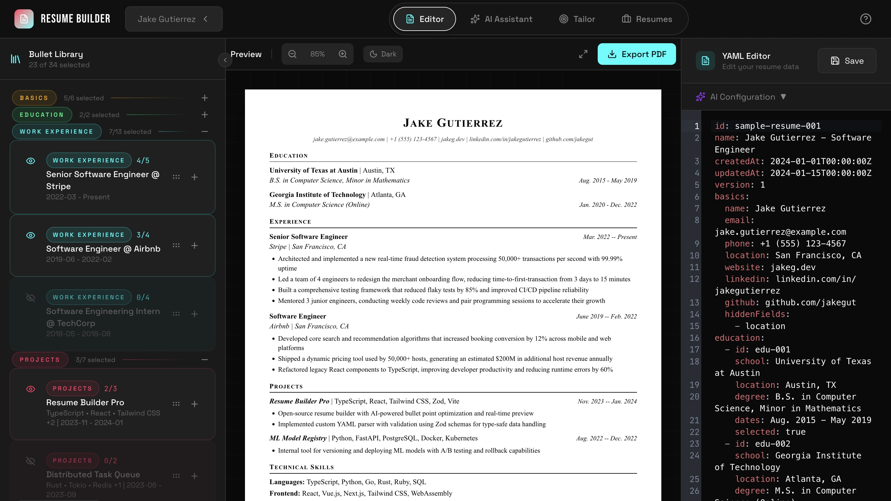

# Building a Privacy-First AI-Assisted Resume Builder: A Case Study in AI-Assisted Development

Resume tools usually force a choice: fight Word formatting or pay $20/month for generic AI buzzwords. I built something different: a YAML-based resume builder with bullet selection management, AI copywriting, and a dark theme called "Direct Flash." Four cutting-edge AI agents helped build it: Paquita (Claw), Claude 4.6 (released Feb 2026), Kimi K2.5, and GPT 5.4 (released March 2026).


*The three-panel layout: Bullet Library (left), Preview (center), YAML Editor (right)*

---

## The Problem

Resumes are usually treated as documents rather than data. Customizing for different roles means copy-pasting paragraphs and hoping formatting doesn't break. There's no way to maintain a library of achievements and select which ones to include for the specific job.

I needed a system where:
- Resumes are stored in plain text, can be version-controlled, and lightweight. `YAML !`
- I can maintain multiple bullet points per role and toggle selections
- PDF output follows professional templates (Jake's LaTeX Resume format)
- AI assists with copywriting for optimization
- AI tailoring based on a job posting

---

## Phase 1: Prototyping with Paquita (Claw)

The project started with Paquita, my Claw instance running on Kimi K2.5 in Hermes-Agent. The initial requirement was straightforward: build a foundation for YAML editing with bullet selection.

We first explored the idea more in depth, from "I also want to explore the idea of creating a json or markdown base resume builder that allows me to quickly customize resumes for different postings." to a detailed requirement needs above. 

After I cleared up the requirements and had a full list, I prompted a local MVP from Paquita:
> Build me a YAML resume builder that meets these requirements: 
> - Resumes are stored in plain YAML
> - I can maintain multiple bullet points per role and toggle selections
> - PDF output follows professional templates (Jake's LaTeX Resume format)
> - AI assists with copywriting for optimization
> - AI tailoring based on a job posting


Paquita delivered a React/TypeScript scaffold with:
- YAML editing via CodeMirror
- Basic bullet library with checkbox selection
- localStorage persistence
- Direct browser-to-LLM API calls (no proxy server)

The prototype validated the core concepts: YAML as source of truth, selection state decoupled from data, and client-side AI integration. It was functional but unpolished, it was good enough to validate the idea.

---

## Phase 2: Architecture with Claude 4.6

With the idea validated, I started thinking of sharing this with other people but I was quickly struck with the idea of internet people using my inference budget up in mere seconds. Therefore, before building further, I needed proper architecture. 

With the help of Claude 4.6, who excels at big-picture thinking and edge-case analysis, I sketched out the architecture for my new site.
> Can you help me come up with a great architecture for this project? This is a YAML based resume builder that adds two main value points: 
> 1. AI assisted copywriting (I need to change it to BYOK local browser only) 
> 2. let's you save multiple bullet points and only render a selection of them for better resume tailoring. 
> I want this to be served as serverless ecosystem so personal data stays in the browser but with anonymized observability to catch bugs and model or provider issues.

Claude 4.6 asked critical questions: How should the three-panel layout work? What's the AI provider abstraction strategy? How do we handle the PDF template system? I specified and iterated until we got a clear PLAN.md

The output was PLAN.md, a comprehensive specification covering:
- 7-phase implementation roadmap
- Data models with Zod schemas
- React Context state management
- Sentry integration with PII scrubbing
- Direct Flash theme design system

The architecture cleanly separates data (YAML) from presentation (selection state). This enables version control, easy editing, and data portability without the prototype's tight coupling.

---

## Phase 3: Implementation with Kimi K2.5

Moving on to implementation, Kimi K2.5 handled the bulk of the work. Kimi is particularly effective at translating specifications into working code across multiple domains while staying cheap and fast.

The implementation spanned:
- **Stage 1-2**: TypeScript types, Zod schemas, storage layer
- **Stage 3**: Layout system with resizable panels
- **Stage 4**: Editor integration (CodeMirror 6), bullet manager
- **Stage 5**: AI client with OpenAI-compatible API support
- **Stage 6**: PDF export with React-PDF
- **Stage 7**: Polish, error boundaries, keyboard shortcuts

I triggered the implementation by launching parallel Kimi K2.5 subagents:
> "Go ahead and spin up the proper subagents to build out the project while keeping good git hygiene and responsible commits at each step. Use parallelization when possible without going into collision."

Opencode then spun up multiple Kimi subagents that worked in parallel across the seven implementation phases.
From TypeScript types and Zod schemas to the three-panel fluid layout, CodeMirror integration, AI client, and React-PDF export. 
The result was a massive scaffold commit (69ae831) that included the complete project structure: ~3,000 lines of TypeScript, full React contexts, all components, and working PDF generation. 
While the initial implementation needed refinement (padding was cramped, colors needed tweaking, UI elements weirdness), the architecture was solid and the core functionality worked immediately. And all of this in under 5 minutes, proving that parallel subagent execution can deliver a functional foundation when guided by a clear specification.

---

## Phase 4: The Fluid Layout System

The final layout architecture uses three resizable panels:

**Left Panel (Floating Sidebar)**: Bullet library
- Collapsible (56px to 400px)
- Shows selection counts when collapsed
- Drag-to-resize with visual feedback

**Center Panel (Preview)**: Resume preview
- Zoom controls (50%-150%)
- Fullscreen mode
- Page overflow detection
- PDF export button

**Right Panel (Workspace)**: Editor/AI/Tailoring
- Tabs for Editor, AI Copywriting, Tailoring
- CodeMirror 6 for YAML editing
- AI configuration bar

All panel widths persist to localStorage. The `useResizablePanels` hook handles mouse/touch events and constraints.

Glassmorphism effects (`backdrop-blur-md`) on the header and dropdowns add depth without sacrificing readability.

---

## Phase 5: UI Refinement

### Flexible Columns

The initial implementation was functional but cramped. UI density matters for tools you spend time in. 

> *"Can we make the columns user resizable? Keep the resize between sessions as well. Add an overlay button on the bottom left to reset the columns to default."*

Kimi then made the changes in one shot, implementing drag handles with visual feedback, enforcing min/max width constraints, and persisting panel widths to localStorage.
The reset button calls localStorage.removeItem('panelWidths') and restores the default three-column layout.

### Theme System

While Direct Flash worked, users (including me) sometimes want options. Kimi implemented a theme system supporting:

1. **Direct Flash** (default): Red/cyan on pure black
2. **Purple Flash**: Purple accent variant
3. **Gradient Flow**: Subtle gradient backgrounds
4. **Warm Amber**: Gold/orange tones
5. **Full Spectrum**: All accent colors

Theme preferences persist to localStorage. The floating theme switcher provides instant feedback.

### Glassmorphism and Animations

I wanted the UI to feel modern and premium, inspired by Apple's liquid glass aesthetic. The frosted glass look adds depth without clutter.

> *"Add glassmorphism effects to the overlays in the header and dropdowns using backdrop-blur. I want that frosted glass look like Apple's liquid glass; semi-transparent panels that float above the content."*

Kimi implemented them but failed to take into account some CSS hierarchy overwrite issues that I had to untangle manually. After doing so we had liquid glass inspired overlay menus.

These details transform static UI into something that feels alive and responsive to your actions.

---

## Phase 6: GPT 5.4 for Targeted Features

GPT 5.4 had just dropped (March 5, 2026) and I wanted to put it through its paces. I already had experience using the Codex app for PDF rendering work [Markdown2Paper][./posts/markdown2paper/]. This made it the perfect choice for targeted polish features that required precise implementation.

### PDF Rendering Issues

I noticed difference between the spacing on the preview pane and the final PDF file the file exported. I took a screenshot of each render out and added the specific YAML input and sent it GPT 5.4's way.

Apparently Kimi had hallucinated extra margins on the document causing a double margin everywhere in addition to line spacing at 2x instead of 1x. GPT 5.4 got these wrinkles ironed out.

### Section Color Coding

The bullet library needed visual organization.

> *"Let's add section differentiation in the bullet library. Use colors to separate roles/work experience from projects."*

GPT 5.4 implemented color-coded sections:
- Basics: Amber
- Education: Green
- Experience: Cyan
- Projects: Red
- Skills: Purple

This creates visual hierarchy. Users immediately understand their content distribution.

### Preview Dark Mode

For late-night editing, a preview toggle without affecting export:

> *"Add flash protection for the preview. Keep the default white but add a button next to zoom to toggle dark mode. This does not change the final rendered version."*

### AI Model Discovery

The original implementation required manual model name entry. GPT 5.4 built auto-discovery:

> *"Let's implement a model selector in our AI settings. Once the key and base URL are set, attempt to get models from the base URL + /models. If no response, let the user type in the model. If we got data, add it to the model selector with a type-in fallback."*

The implementation fetches available models from any OpenAI compatible provider, and presents them in a searchable dropdown with autocomplete.

---

## Phase 7: Production Readiness

### README Documentation


I let GPT 5.4 read through the codebase and document it in the README. I changed some wording to match my personal voice, but it mostly one-shotted it.

### Vercel & SpeedInsights

I wanted to deploy this new site in Vercel to test it out. The process was extremely simple, just select the repo and hit deploy.

I then added the Sentry environment variables and voilà! Site was live and I could see any errors coming in. 

Performance monitoring from Vercel was added for production deployment:

SpeedInsights tracks Core Web Vitals and performance metrics without requiring additional configuration.

### Sentry Observability

Error tracking with privacy-first configuration:

```typescript
// src/instrument.ts
Sentry.init({
  dsn: import.meta.env.VITE_SENTRY_DSN,
  sendDefaultPii: false,
  
  beforeSend(event) {
    // Strip sensitive data
    delete event.extra?.yamlText;
    delete event.extra?.resumeData;
    delete event.extra?.apiKey;
    
    // Remove local variable values from stack traces
    if (event.exception?.values) {
      event.exception.values.forEach((exception) => {
        if (exception.stacktrace?.frames) {
          exception.stacktrace.frames.forEach((frame) => {
            delete frame.vars;
          });
        }
      });
    }
    
    return event;
  },
  
  ignoreErrors: [
    /YAMLException/,      // User-facing parsing errors
    /Failed to fetch/,    // AI network issues (expected)
    /NetworkError/,
  ],
});
```

**Key privacy features**:
- Resume YAML content stripped before sending
- API keys removed from breadcrumbs
- Local variable values removed from stack traces
- Session replays mask all text inputs
- Network response bodies excluded

The Sentry Vite plugin generates source maps for production builds, enabling accurate stack traces without exposing source code.

---

## Multi-Agent Workflow Analysis

This project showcase effective multi-agent collaboration:

| Agent | Strengths | Role in Project |
|-------|-----------|-----------------|
| **Paquita (Claw)** | Rapid prototyping, quick iteration | Initial scaffold, core concepts |
| **Claude 4.6** | Architecture, edge-case analysis | PLAN.md, system design, Sentry planning |
| **Kimi K2.5** | Implementation breadth, consistency | Bulk feature development |
| **GPT 5.4** | Targeted polish, tight feedback loops | Specific features, bug fixes|


The key insight: match the agent to the task. Don't ask Claude to tweak CSS. Don't ask Kimi to design architecture. Each agent has comparative advantages. Use them appropriately.

---

## Technical Highlights

### YAML as Source of Truth

Storing resumes as YAML provides:
- **Version control**: Git diffs show exactly what changed
- **Portability**: No proprietary lock-in
- **Readability**: Human-editable format
- **Validation**: Zod schemas catch errors at parse time

### BYOK AI Architecture

AI integration uses client-side API calls:
```typescript
// Direct browser-to-LLM API
const response = await fetch('https://api.groq.com/openai/v1/chat/completions', {
  method: 'POST',
  headers: { 'Authorization': `Bearer ${apiKey}` },
  body: JSON.stringify({ model, messages })
});
```

No proxy server, no subscription required, no data leaves the browser.

### Privacy-First Observability

Sentry integration demonstrates that error tracking doesn't require sacrificing privacy:
- All sensitive data stripped before transmission
- PII scrubbing in `beforeSend` hook
- Ignored errors for expected failures (YAML parsing, network issues)
- 10% sampling rate for performance traces

This approach provides production monitoring without tracking user data.

---

## Metrics

- **~50 commits** from initial prototype to completion
- **~3,000 lines** TypeScript (excluding dependencies)
- **4 AI agents** across the development cycle
- **5 color themes** with CSS variable system
- **0 subscriptions** required (BYOK model)

---

## Lessons Learned


**Multi-agent development is additive**: Different models excel at different tasks. The combination exceeds individual capabilities.

**Structured data over documents**: YAML's version-control friendliness and portability outweigh WYSIWYG convenience for this use case.

**Privacy-first observability is possible**: Sentry's `beforeSend` hook and PII scrubbing prove you can have monitoring without surveillance.

**Specificity in prompts**: "Swap the icons" fails. "Swap icons AND button actions, eye on left for visibility, plus on right for expand" succeeds. Precision matters.

---

## Conclusion

The resume builder is complete and deployed. It serves its purpose: YAML editing, bullet library with selection, AI assistance, and professional PDF export. It won't write your resume for you. You still need accomplishments to describe. But it removes the friction from the process.

If you want to free yourself up from word documents and formatting hell, you can give it a try at [resume-quiver][https://resume-quiver.vercel.app/]
And if you like to modify the template or run it yourself, check-out: [github.com/Aureliusf/ResumeQuiver](https://github.com/Aureliusf/ResumeQuiver)

