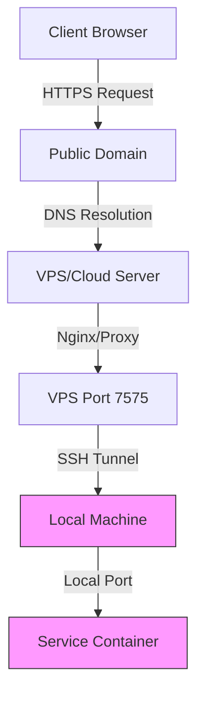
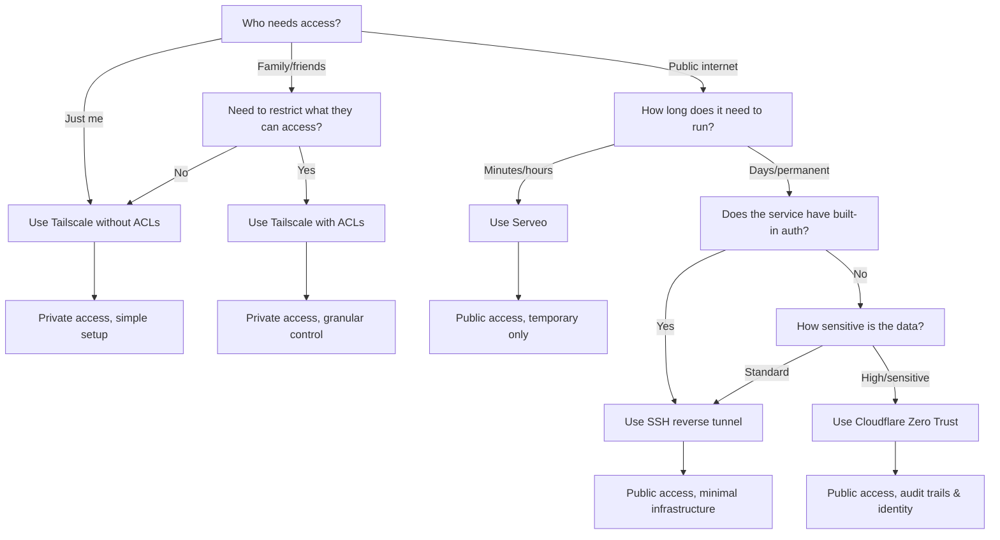

# Serving Local Services: From Tailscale to Cloudflare Zero Trust

Self-hosting requires exposing local services to the internet, but not all services have the same access requirements or security constraints. This guide covers four tunneling solutions that solve different problems: private mesh VPNs for personal use, SSH reverse tunnels for minimal public exposure, ephemeral tunnels for quick testing, and Cloudflare Zero Trust for enterprise-grade access control.

---

## 1. Tailscale: Private Mesh for Personal and Family Access

**What it is:** Zero-configuration mesh VPN built on WireGuard that creates an encrypted overlay network between your devices.

**Best for:** Personal access to home services and selectively sharing specific services with family members without exposing them to the public internet.

### Setup

Install the Tailscale client on each device and authenticate. The control plane handles NAT traversal automatically.

### Access Control with ACLs

Tailscale uses JSON-based Access Control Lists to define who can reach what:

```json
{
  "acls": [
    {"action": "accept", "src": ["your-user@domain.com"], "dst": ["*:*"]},
    {"action": "accept", "src": ["group:immich-users"], "dst": ["olivia:2283"]},
    {"action": "accept", "src": ["group:calibre-users"], "dst": ["victoria:8083"]}
  ],
  "groups": {
    "group:immich-users": ["sara@example.com"],
    "group:calibre-users": ["dad@example.com", "mom@example.com"]
  }
}
```

This configuration gives you full access to all services while restricting family members to specific ports on specific machines.

### Pricing

Free tier supports up to 100 devices with unlimited users on the same tailnet.

### Limitations

- Requires client installation on every device accessing your services
- Free tier limited to 100 devices
- No audit logging of user actions within services
- All users must have Tailscale accounts

---

## 2. SSH Reverse Tunnels: Public Access with Minimal Exposure

**What it is:** A method to expose a single local service through a remote VPS without opening firewall ports or exposing your entire server.

**Best for:** Publicly accessible services that already have built-in authentication, where you want to avoid exposing your local network infrastructure.

### How It Works



The SSH tunnel creates an encrypted connection from your local machine to the VPS. Traffic flows: Internet → VPS → SSH tunnel → Local service.

### Setup

On your local server:

```bash
autossh -M 0 -R 7575:localhost:5678 user@vps-server \
  -o "ServerAliveInterval 60" \
  -o "ServerAliveCountMax 3" \
  -o "ExitOnForwardFailure=yes"
```

This forwards remote port 7575 to local port 5678. Configure Nginx on the VPS to proxy requests from your domain to localhost:7575.

### Pricing

Requires a VPS. Budget providers like Vultr offer suitable instances for approximately $3.50/month.

### Limitations

- No user management beyond what the service provides
- No audit logging of who accessed what
- Single service per port configuration
- SSH tunnel stability requires monitoring (autossh handles reconnection)
- Cannot easily revoke access for specific users without changing service passwords

### When to Use

When you need public access to a service with its own authentication (like n8n, a custom dashboard, or a web application) and want minimal infrastructure complexity.

---

## 3. Serveo: Ephemeral Public Tunnels for Testing

**What it is:** A free, ephemeral SSH-based tunneling service that exposes local services to the public internet without any installation or account setup.

**Best for:** Quick prototypes, temporary demos, testing webhooks, or sharing work-in-progress with collaborators for short periods.

### Setup

No installation required. From your local machine:

```bash
ssh -R myapp:80:localhost:3000 serveo.net
```

This exposes your local port 3000 as `myapp.serveo.net`. The tunnel stays active as long as the SSH connection remains open.

### Pricing

Completely free. No account required.

### Limitations

- **Unreliable for long-term use:** Tunnels disconnect every 12-24 hours even with keepalive settings
- **No custom domains:** Must use serveo.net subdomains
- **No persistence:** No guarantee the same subdomain will be available later
- **Security concerns:** Public URLs accessible to anyone who knows the address
- **Single point of failure:** If Serveo is down, your tunnel is down

### When to Use

Only for ephemeral needs: demonstrating a prototype to a client, testing a webhook integration, sharing a local development server with a teammate for 30 minutes. Do not use for production services or anything requiring reliability.

---

## 4. Cloudflare Tunnels + Zero Trust: Enterprise-Grade Access Control

**What it is:** A managed tunnel solution that combines Cloudflare's edge network with identity-based access policies and detailed audit logging.

**Best for:** Sensitive services requiring identity verification, temporary access grants, and comprehensive audit trails.

### Setup

Install `cloudflared` on your local machine:

```bash
# Create and authenticate tunnel
cloudflared tunnel create my-service

# Configure tunnel in ~/.cloudflared/config.yml
# Then route traffic from dashboard

# Run tunnel
cloudflared tunnel run my-service
```

In the Cloudflare dashboard, configure Zero Trust Access policies:

- Require authentication via Google, GitHub, or SAML
- Restrict by email domain or specific users
- Set session timeouts
- Enable additional security headers

### Key Features

- **No open ports:** Your local machine initiates outbound connections only
- **Identity-based access:** Users authenticate before reaching the service
- **Audit logging:** Complete trail of who accessed what and when
- **Geographic restrictions:** Block or allow access by country
- **Device posture:** Require specific security configurations on client devices

### Pricing

Free tier includes unlimited users for basic access policies and standard Zero Trust features.

### Limitations

- Requires Cloudflare account and domain managed by Cloudflare nameservers
- More complex initial setup than Tailscale or SSH tunnels
- Dependent on Cloudflare's infrastructure
- Session-based access requires re-authentication

### When to Use

When handling sensitive data (financial, personal, or business-critical), requiring compliance audit trails, or providing temporary access to external collaborators.

## Comparison Matrix

| Criteria | Tailscale | SSH Tunnel | Serveo | Cloudflare Zero Trust |
|----------|-----------|------------|--------|----------------------|
| **Setup Complexity** | Low | Low | Lowest | Medium |
| **Client Installation** | Required on all devices | None | None | None |
| **Public Internet Access** | No | Yes | Yes | Yes |
| **Reliability** | High | High | Low (disconnects ~12h) | High |
| **User Management** | ACL-based | None (service-level) | None | Identity provider integration |
| **Audit Logging** | Connection logs only | None | None | Comprehensive access logs |
| **Cost** | Free (100 devices) | ~$3.50/month VPS | Free | Free tier available |
| **Custom Domain** | Yes (MagicDNS) | Yes | No | Yes |
| **Best For** | Private/family services | Simple public services | Ephemeral/testing | Sensitive/enterprise tools |

## Choosing the Right Solution

The progression from one solution to the next typically follows these decision points:

**Start with Tailscale (no ACLs) when:**
- Only you need access to your services
- You want the simplest possible setup
- All your devices can run the Tailscale client
- No need to restrict access between devices

This is the minimal configuration: install Tailscale, authenticate, and all your devices can reach each other on a flat network.

**Add Tailscale ACLs when:**
- Family members or friends need access to specific services
- You want to restrict what others can reach (e.g., guests can access Immich but not your NAS)
- You need to segment access by service or user group
- You want to follow the principle of least privilege

ACLs add complexity but provide granular control without requiring additional infrastructure.

**Use Serveo for quick tests when:**
- You need to share a local development server temporarily
- Testing webhook integrations that require a public URL
- Demonstrating prototypes to clients or teammates
- You can tolerate disconnects and don't need persistence

**Move to SSH reverse tunnels when:**
- You need public internet access without client installation
- The service has built-in authentication
- You want to expose a single service reliably (not just for testing)
- Budget constraints favor a simple VPS over SaaS solutions

**Implement Cloudflare Zero Trust when:**
- Handling sensitive business data
- External users need temporary access
- Audit compliance is required
- You need granular access control without managing VPN clients

## Hybrid Approach

These solutions are not mutually exclusive. A typical homelab might use:

- **Tailscale** for personal access to Home Assistant, Immich, and internal dashboards
- **SSH tunnel** for a public n8n instance with its own authentication
- **Serveo** for quick client demos or webhook testing during development
- **Cloudflare Zero Trust** for a business intelligence tool connected to an ERP with sensitive financial data

I use all four in my own homelab!

Each tool addresses a specific threat model and access pattern.

## Security Considerations

Regardless of the tunneling solution:

1. **Keep services updated:** Tunnel security does not protect against vulnerable applications
2. **Use strong authentication:** Even with Cloudflare Zero Trust, implement service-level passwords
3. **Monitor access:** Review logs regularly (where available) for unusual patterns
4. **Principle of least privilege:** Only expose services that must be accessible externally
5. **Network segmentation:** Isolate tunnel endpoints from critical infrastructure where possible

## Conclusion

There is no single "best" serving solution. Tailscale excels at private mesh networking for personal use and can be extended to trusted users with ACLs. SSH reverse tunnels provide the simplest path to public exposure with minimal infrastructure. Serveo offers instant gratification for ephemeral needs. Cloudflare Zero Trust offers enterprise-grade access control for sensitive applications.

Match the tool to your specific requirements: user base, security needs, complexity tolerance, and budget. All four can coexist in a well-architected homelab, each serving the use case it handles best.

---

## Decision Tree: Which Tunnel Solution?



**Quick Reference:**
- **Light gray boxes:** Private access solutions (Tailscale)
- **Dashed border:** Ephemeral/temporary only (Serveo)
- **Medium gray boxes:** Public with minimal infrastructure (SSH)
- **Dark gray box:** Enterprise-grade security (Cloudflare)
